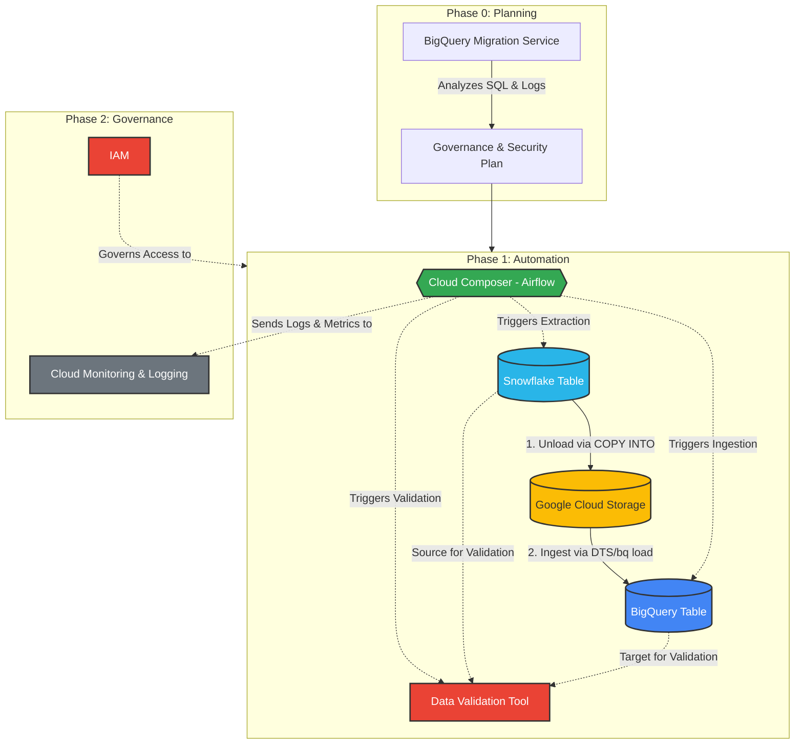
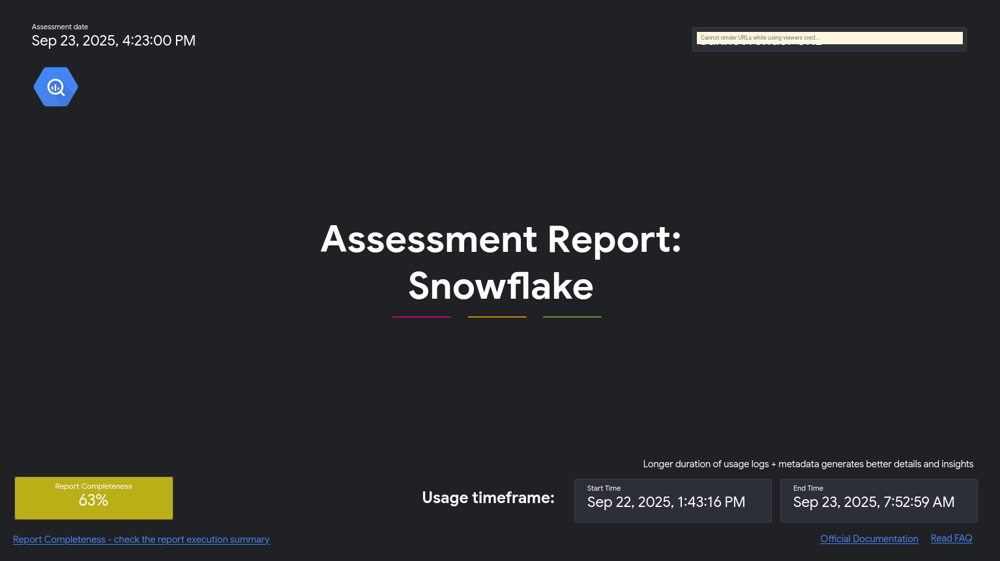
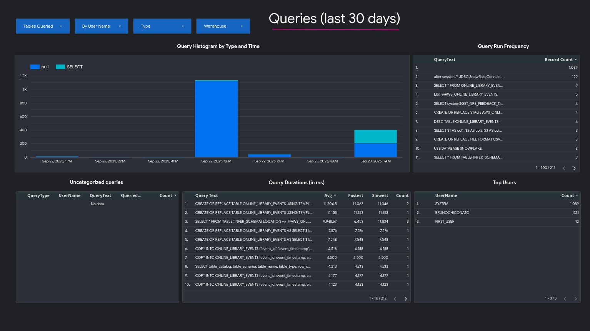
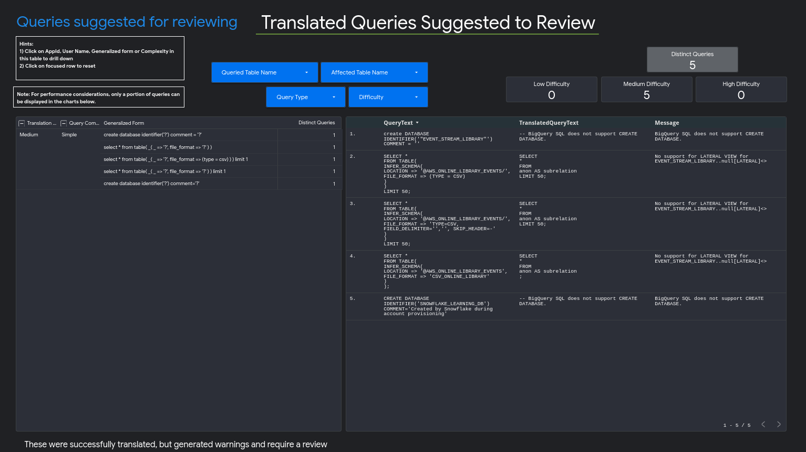
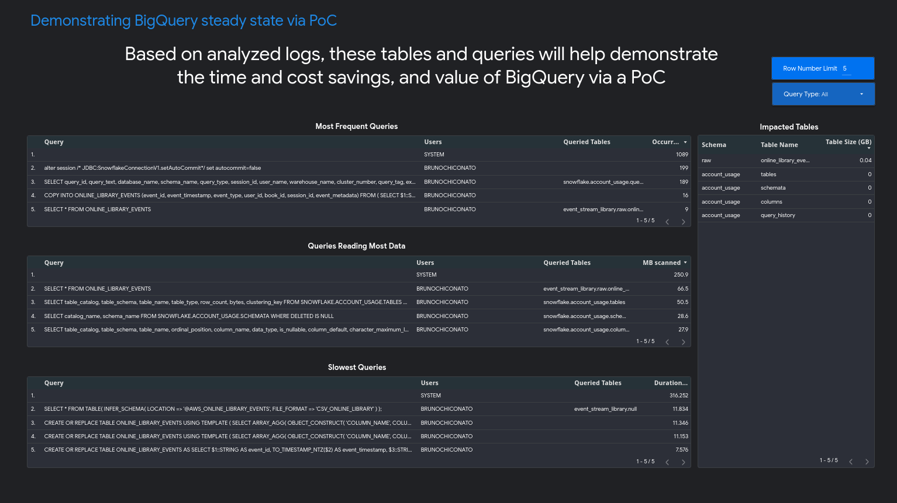

# Migration Project: A Snowflake to BigQuery Simulation

This repository documents a hands-on project simulating an end-to-end data warehouse migration from Snowflake to Google BigQuery. The project is divided into key phases, from initial data ingestion into the source system (Snowflake) to the assessment and planning for the migration to the target system (BigQuery).

**Architecture of the project:**



## Phase 1: Source Environment Setup (Ingesting Data into Snowflake)

This phase covers the setup of a production-safe data ingestion pipeline to load raw CSV data from an AWS S3 bucket into a Snowflake table.

### 1. Create an AWS IAM Policy (Read-Only)

This policy grants the minimal S3 permissions required to load data from a specific bucket and prefix. In the AWS IAM console, create a new policy using the JSON editor.

*Replace `<bucket>` and `<prefix>` with your S3 details.*

```json
{
  "Version": "2012-10-17",
  "Statement": [
    {
      "Effect": "Allow",
      "Action": [
        "s3:GetObject",
        "s3:GetObjectVersion"
      ],
      "Resource": "arn:aws:s3:::<bucket>/<prefix>/*"
    },
    {
      "Effect": "Allow",
      "Action": [
        "s3:ListBucket",
        "s3:GetBucketLocation"
      ],
      "Resource": "arn:aws:s3:::<bucket>",
      "Condition": {
        "StringLike": {
          "s3:prefix": [
            "<prefix>/*"
          ]
        }
      }
    }
  ]
}
```

### 2. Create an AWS IAM Role

This role will be assumed by Snowflake to access the S3 bucket securely.

1.  In the IAM console, navigate to **Roles** and click **Create role**.
2.  For the trusted entity type, select **AWS account** and choose **Another AWS account**.
3.  In **Account ID**, enter your own AWS account ID as a temporary placeholder.
4.  Check the box for **Require external ID** and enter a placeholder (e.g., `0000`).
5.  Attach the read-only policy created in the previous step.
6.  Name the role (e.g., `snowflake-s3-read-role`) and create it.
7.  Take note of the **Role ARN** for the next step.

### 3. Create a Storage Integration in Snowflake

This object establishes a secure, credential-less trust relationship between Snowflake and your AWS IAM Role.

```sql
CREATE DATABASE IF NOT EXISTS EVENT_STREAM_LIBRARY;
USE DATABASE EVENT_STREAM_LIBRARY;

CREATE SCHEMA IF NOT EXISTS RAW;
USE SCHEMA RAW;

CREATE STORAGE INTEGRATION AWS_S3_INTEGRATION
  TYPE                     = EXTERNAL_STAGE
  STORAGE_PROVIDER         = 'S3'
  ENABLED                  = TRUE
  STORAGE_AWS_ROLE_ARN     = 'arn:aws:iam::<your_aws_account_id>:role/<YourRoleName>'
  STORAGE_ALLOWED_LOCATIONS = ('s3://online-library-events/raw_online_library_events/');

-- Describe the integration to retrieve the Snowflake IAM user and External ID
DESC INTEGRATION AWS_S3_INTEGRATION;
```

After running `DESC INTEGRATION`, record the values for `STORAGE_AWS_IAM_USER_ARN` and `STORAGE_AWS_EXTERNAL_ID`.

### 4. Update the AWS Role's Trust Policy

Return to the IAM Role in the AWS console and edit its trust relationship. Replace the existing JSON with the following, substituting the two values you recorded from Snowflake.

```json
{
  "Version": "2012-10-17",
  "Statement": [
    {
      "Sid": "",
      "Effect": "Allow",
      "Principal": { "AWS": "<PASTE_STORAGE_AWS_IAM_USER_ARN_HERE>" },
      "Action": "sts:AssumeRole",
      "Condition": {
        "StringEquals": {
          "sts:ExternalId": "<PASTE_STORAGE_AWS_EXTERNAL_ID_HERE>"
        }
      }
    }
  ]
}
```

### 5. Create a File Format and External Stage

These Snowflake objects define how to parse the CSV files and where to find them.

```sql
-- Define the CSV file structure
CREATE OR REPLACE FILE FORMAT CSV_ONLINE_LIBRARY
  TYPE = CSV
  FIELD_DELIMITER = ','
  SKIP_HEADER = 1
  FIELD_OPTIONALLY_ENCLOSED_BY = '"'
  TRIM_SPACE = TRUE
  ENCODING = 'UTF8';

-- Create the stage pointing to the S3 bucket via the integration
CREATE OR REPLACE STAGE AWS_ONLINE_LIBRARY_EVENTS
  STORAGE_INTEGRATION = AWS_S3_INTEGRATION
  URL = 's3://online-library-events/raw_online_library_events/'
  FILE_FORMAT = CSV_ONLINE_LIBRARY;
```

### 6. Create the Target Table

Create the destination table in Snowflake. The `event_metadata` column uses the `VARIANT` type to store semi-structured JSON data.

```sql
CREATE OR REPLACE TABLE ONLINE_LIBRARY_EVENTS (
  event_id         STRING,
  event_timestamp  TIMESTAMP_NTZ,
  event_type       STRING,
  user_id          STRING,
  book_id          STRING,
  session_id       STRING,
  event_metadata   VARIANT
);
```

### 7. Load Data Using the `COPY INTO` Command

Finally, ingest the data from the S3 files into the Snowflake table. A `SELECT` transformation is used to cast columns and parse the metadata string into the `VARIANT` type.

```sql
COPY INTO
    ONLINE_LIBRARY_EVENTS (event_id, event_timestamp, event_type, user_id, book_id, session_id, event_metadata)
FROM (
  SELECT
    $1::STRING,
    TO_TIMESTAMP_NTZ($2),
    $3::STRING,
    $4::STRING,
    $5::STRING,
    $6::STRING,
    TRY_PARSE_JSON($7)
  FROM
    @AWS_ONLINE_LIBRARY_EVENTS
);
```

At this point, the source environment is fully configured and populated with data, simulating a real-world production system ready for migration.

## Phase 2: Migration Assessment (Planning the Move to BigQuery)

With the source environment established, the first step of the migration is to create a detailed plan using the **BigQuery Migration Assessment**. This tool generates a report that helps evaluate storage costs in BigQuery, identify workload optimization opportunities, and estimate the time and effort required for the migration.

### 1. Generate Authentication Keys for Snowflake

The assessment process requires extracting metadata and query logs from Snowflake. This is done using Google's `dwh-migration-dumper` tool, which authenticates using a key pair.

1.  **Generate a private key:**

    ```bash
    openssl genrsa 2048 | openssl pkcs8 -topk8 -inform PEM -out rsa_key.p8 -nocrypt
    ```

2.  **Generate the corresponding public key:**

    ```bash
    openssl rsa -in rsa_key.p8 -pubout -out rsa_key.pub
    ```

3.  **Assign the public key to your Snowflake user:**

      * Copy the content of the `rsa_key.pub` file (excluding the `-----BEGIN...` and `-----END...` lines).
      * Run the `ALTER USER` command in Snowflake:
        ```sql
        ALTER USER your_user_name SET RSA_PUBLIC_KEY='PASTE_PUBLIC_KEY_CONTENT_HERE';
        ```
      * **Note:** For this simulation, the user was granted `ACCOUNTADMIN` privileges. In a real-world scenario, a dedicated user with `IMPORTED PRIVILEGES` would be created.

### 2. Extract Metadata and Query Logs

Install the `dwh-migration-dumper` tool from the [official GitHub repository](https://github.com/google/dwh-migration-tools). Then, run the following commands to extract the necessary information.

1.  **Extract metadata:**

    ```bash
    dwh-migration-dumper \
    --connector snowflake \
    --host <YOUR_SNOWFLAKE_HOST> \
    --user <YOUR_USER_NAME> \
    --role <YOUR_ROLE_NAME> \
    --warehouse <YOUR_WAREHOUSE> \
    --assessment \
    --private-key-file /path/to/your/rsa_key.p8
    ```

2.  **Extract query logs:**

    ```bash
    dwh-migration-dumper \
    --connector snowflake-logs \
    --host <YOUR_SNOWFLAKE_HOST> \
    --user <YOUR_USER_NAME> \
    --role <YOUR_ROLE_NAME> \
    --warehouse <YOUR_WAREHOUSE> \
    --assessment \
    --private-key-file /path/to/your/rsa_key.p8
    ```

This process will generate two `.zip` files containing the extracted data.

### 3. Upload Extracted Files to Google Cloud Storage

Create a GCS bucket and upload the two generated `.zip` files into the same folder. Do not modify or extract the contents of the zip files.

### 4. Configure Permissions in GCP

To run the assessment, you need to grant the necessary permissions to your user and to the BigQuery Migration Service.

1.  **Enable the BigQuery Migration API:** In the Google Cloud console, navigate to the BigQuery Migration API page and click **Enable**.

2.  **Create a custom IAM role** with the required permissions for the service:

    ```bash
    gcloud iam roles create BQMSrole \
      --project=<your_gcp_project_id> \
      --title="BQMS Assessment Role" \
      --permissions=bigquerymigration.workflows.create,bigquerymigration.workflows.get,bigquerymigration.workflows.list,bigquerymigration.workflows.delete,resourcemanager.projects.get,serviceusage.services.enable,storage.objects.get,storage.objects.list
    ```

3.  **Grant the custom role to your user:**

    ```bash
    gcloud projects add-iam-policy-binding \
      <your_gcp_project_id> \
      --member=user:<your_email> \
      --role=projects/<your_gcp_project_id>/roles/BQMSrole
    ```

### 5. Run the Migration Assessment

1.  **Create a BigQuery dataset** in your project to store the results of the assessment (e.g., `migration_assessment_results`).
2.  In the Google Cloud console, navigate to **BigQuery > Migration**.
3.  Click **Start assessment** and fill out the configuration dialog, pointing to the GCS folder where you uploaded the zip files and the BigQuery dataset you just created.

After a few minutes, the assessment report will be generated and available for viewing in Looker Studio, providing valuable insights for the next phases of the migration.




